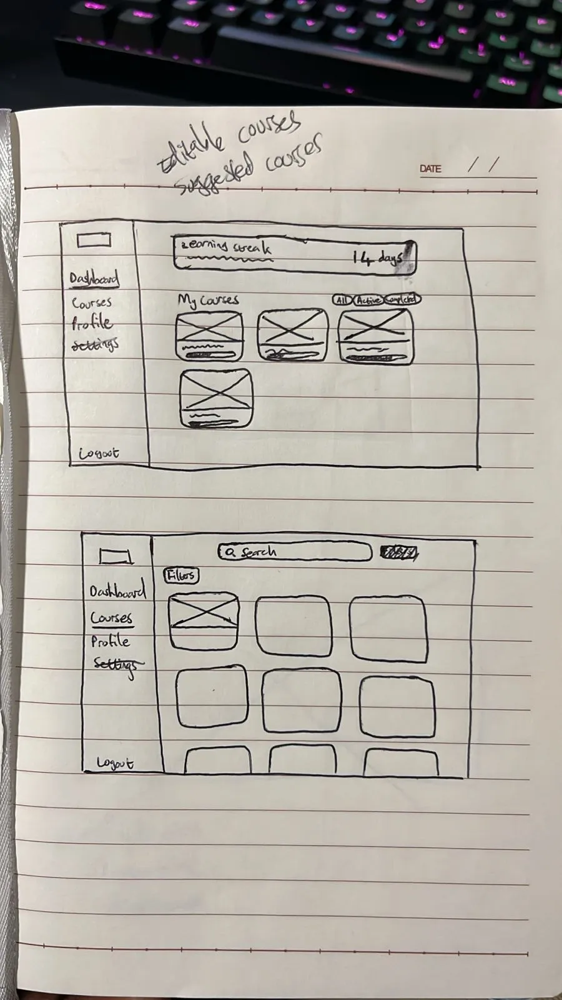
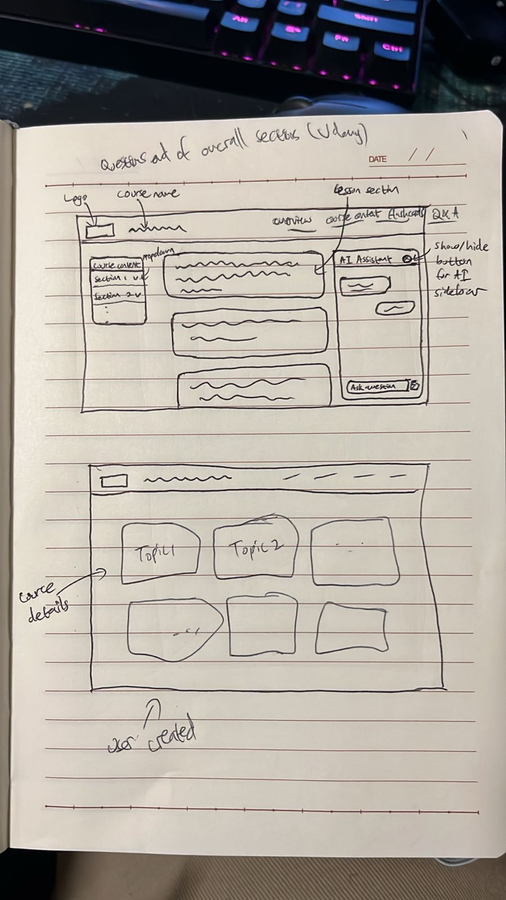
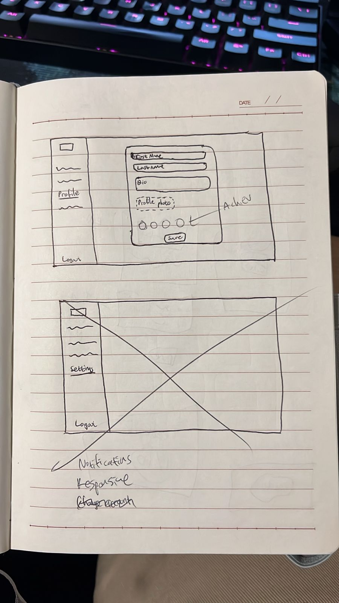
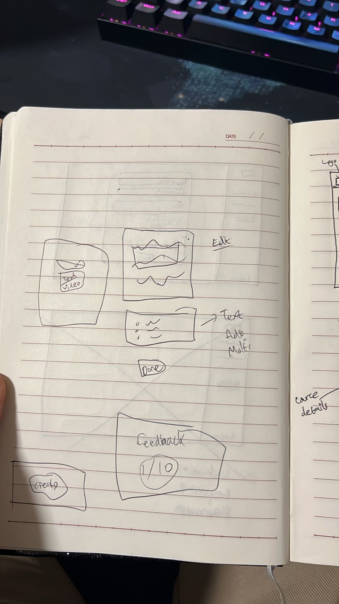

Wireframes
==========

Overall Design Philosophy
------------------------

- **Clean & Focused**: The interface is minimalistic to reduce cognitive load, especially for users concentrating on learning a new language.
- **Modular & Consistent**: The Course Builder uses clear, reusable components (text, multiple choice, audio input) that align with their display in the Lesson Player.
- **Gamification Hints**: Subtle use of progress bars, badges, streak counters, and positive reinforcement to encourage consistent learning.
- **Community-First**: Features for rating, commenting, and suggesting edits are easily accessible but non-intrusive.

Pages Overview
-------------

1. Course Explorer
~~~~~~~~~~~~~~~~~

**Purpose**: The homepage and primary discovery mechanism for learners.

**Wireframe Discussion**:

- **Hero Section**: A prominent search bar with quick filters for ``Language``, ``Difficulty``, and ``Popularity``.
- **Personalized Recommendations**: A section titled "Continue Your Journey" or "Recommended for You" displays courses in languages the user is studying.
- **Browse Sections**: Scrolling sections categorize courses: "Most Popular," "Newly Added," "Featured Constructed Languages," etc.
- **Course Cards**: Each card includes:
  - Course Title & Language Flag/Name
  - Author username
  - Average Rating (stars) and number of reviews
  - Difficulty Level (color-coded: Beginner, Intermediate, Advanced)
  - A short preview image/icon of the course content
  - A **"Preview" button** to view the course structure and a sample lesson before enrolling.
- **Advanced Search/Filter Page**: Accessible from the main search bar, this modal or page includes all tags, a full language list (with search), course length, and specific content types (e.g., "has audio exercises").

2. Lesson Player
~~~~~~~~~~~~~~~

**Purpose**: The core learning experience, designed to be immersive, responsive, and highly functional.

**Wireframe Discussion**:

- **Header Context**:
  - Displays Course title, current Unit/Lesson title (e.g., "Spanish 101 > Unit 3: Food > Lesson 2: Ordering at a Restaurant").
  - A collapsible sidebar icon reveals the course outline, showing completed, current, and upcoming lessons for navigation.
- **Main Content Area**: Dynamic, changing based on lesson component type:
  - **Text/Instruction Component**: A clean, readable panel with formatted text, examples, and highlighted key points.
  - **Multiple Choice Question**: Clear question prompt, large tap-targets for answers, with feedback on correct/incorrect selections.
  - **Audio Component**: A large play button for native speaker recordings, a record button for pronunciation practice, and a waveform visualizer for comparison.
  - **Image Matching**: Drag-and-drop or click-to-match functionality.
- **Progress & Navigation Bar (Bottom)**:
  - A "Check Answer" or "Submit" button that changes to "Next" after interaction.
  - A progress bar within the current lesson (e.g., "3/5 exercises completed").
  - Buttons for "Previous," "Next," and "Save & Exit" to bookmark progress.
- **Helper Tools (Floating/Icons)**:
  - A "Report an Issue" button tied to the Community API, allowing users to flag errors in questions or content.

3. Course Builder
~~~~~~~~~~~~~~~~

**Purpose**: A powerful, user-friendly interface for authors to create and structure courses, designed as a multi-step process.

**Wireframe Discussion (Multi-Part)**:

**Part 1: Course Outline View**

- Resembles a project management tool or document outline.
- **Left Panel**: A hierarchical list for structuring the course:
  - Top-level **Units** (e.g., "Greetings," "Grammar Fundamentals").
  - Within Units, **Lessons** can be added.
  - Authors can drag and drop to reorder units and lessons.
- **Main Panel**: Editable content for the selected lesson:
  - **Lesson Title & Objective**: Fields to describe the learning goal.
  - **Component Library**: Drag-and-drop components (Text, Multiple Choice, Audio, Image, Flashcards) to build the lesson.
- **Settings/Properties Panel (Right)**: Configures difficulty, tags, and settings for the course or selected unit/lesson.

**Part 2: Component Editor**

- For a "Multiple Choice" component, a form includes:
  - Field for the question prompt.
  - Fields for answer options, with checkboxes to mark correct answers.
  - Fields for feedback on correct/incorrect answers.
- For an "Audio" component, includes an upload button and a transcript field.

**Part 3: Preview Mode**

- A toggle button allows authors to view the lesson as a learner would, testing flow and functionality before publishing.

4. Review Dashboard
~~~~~~~~~~~~~~~~~~

**Purpose**: A personalized, data-driven hub for reinforcement and spaced repetition, leveraging the Quiz Engine API.

**Wireframe Discussion**:

- **Overview Stats**: Displays "Current Streak: 5 days," "Items due for review: 27," "Total Words Learned: 420."
- **Spaced Repetition Queue**: Lists items (vocabulary, grammar rules) "Due Today" and "Due Soon," pulled by the Quiz Engine API. Each item has a "Review Now" button for a flashcard-style quiz.
- **Weakness Analysis**: A section titled "Areas Needing Work" groups struggling items by category (e.g., "Grammatical Gender," "Verb Conjugations in Past Tense"). Clicking a category starts a targeted practice session.
- **History Charts**: Simple graphs showing activity and accuracy trends over the last week/month to visualize progress.
- **Quick Access**: A button to start a general review session mixing all item types.

5. User Profile
~~~~~~~~~~~~~~

**Purpose**: Tracks personal achievements, manages created content, and showcases community involvement.

**Wireframe Discussion (Tabbed Layout)**:

- **Progress Tab**:
  - Enrolled Courses: Visual cards with progress bars showing completion.
  - Daily streak counter and a calendar view of active learning days.
  - Achievements/badges (e.g., "Polyglot - Studying 5+ languages," "Contributor - Suggested 10+ edits").
- **Authored Courses Tab**:
  - Lists user-created courses with stats: enrolled learners, average rating, total completions.
  - Buttons to edit, view analytics, or archive courses.
- **Contributions Tab**:
  - A feed of community activity: ratings, comments, and suggested edits (with status: Pending, Accepted, Rejected).
  - A karma or "Helpfulness Score" based on upvotes for contributions.

Key User Flows to Prototype
---------------------------

1. **The Learning Loop**: ``Course Explorer`` -> Preview -> Enroll -> ``Lesson Player`` -> Complete lesson -> Redirect to ``Review Dashboard`` for recap.
2. **The Creation Flow**: User Profile -> "Create New Course" -> ``Course Builder`` (Outline -> Add Lessons -> Add Components -> Preview) -> Publish -> appears in ``Course Explorer``.
3. **The Feedback Loop**: Inside ``Lesson Player`` -> see a mistake -> click "Report Issue" / "Suggest Edit" -> submit correction -> notification to course author via ``Community API``.

Wireframes
----------

  

